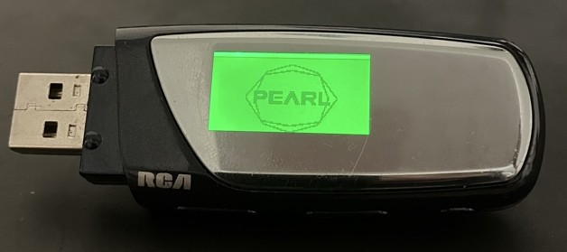

# ParsePlayer

This is a purpose-built app meant for managing MP3 players + a collection of music, and the sooner-than-later-but-eventual home for the Raspberry Pi-based player(s) that I'm building for the same roundabout purpose.

Follow along and I'll try to explain.

## Impetus

I found this ~20-year-old **RCA `PEARL`** of mine recently.

It's missing the USB cover and the battery cover but the little device is still A-Okay & Good-to-go and Linux/Kubuntu was happy to mount it just like any other USB Drive.

> Cool huh?

### It definitely sucks a bit though - `Pain Points`

I have yet to get a micro SD card that it'll use, so I'm rocking with 1GB.

> A lot of music fits in a gig.
>
> Anyone else remember having to scrimp for storage space?

Still, manually moving around files already got old after a day.

> No problem - automation isn't anything new.
>
> Didn't iTunes Sync used to work with whatever USB drive? Might be misremembering - and even so, it wasn't built for this purpose.

### There's some Good Stuff here

> Metadata - who needs it?
>
> Organize by using the FileSystems that the tech-gods have given us.

I didn't realize at first that the Music menu on the `PEARL` is just a file browser.
If you want to organize by `Artist > Album` then it's up to you to bring that structure.

When you're playing a song though, it does show the artist from the MP3 Tags if available. Neat.

**Another Positive**: It's a dumb player - doesn't even track play counts.

It's weird to say, but everytime I set this player to Repeat One feels less heavy than doing the same thing on Spotify or YouTube Music. I'm talking software-bloat but also privacy.

> I just want to keep listening to this song.
>
> I don't want to wonder if _`My Algorithm`_ is going to change as a result.

## What does this add up to?

First off - **something that's easy to build**. "Easy" is relative, but hey.

There's a lot more off-the-shelf ways to build tech (hard and soft) nowadays than even 10 years ago.

### The Hardware

Obviously, my ultimate goal is to reach a **Portable** version which replaces the RCA `PEARL` as my new daily-driver for music. I don't have even one Pi Zero though - so backburner that goes.

I do have a few rPi models, so I'm starting with a Raspberry Pi 4 B as a base, and after thinking it over for a short time I realized that the **Desktop** version is the start here.

> Hey, battery banks exist, so it _can_ be portable technically.

### The Software

This is where I am now, since hardware is useless without software to run on it.

Stack:

- Python / Flask server
- HTMX
- Pico.css

#### Web Interface

#### Desktop Interface
